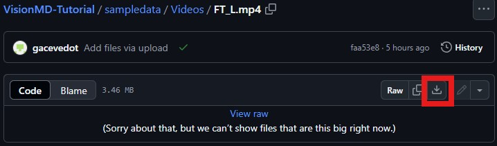

<h1 align="center">VisionMD: An Open-Source Tool for Video-Based Analysis of Motor Function in Movement Disorders</h1>
<div align="center">
  <a href="https://www.linkedin.com/in/gabrielaacevedot/" target="_blank">Gabriela T. Acevedo T.</a><sup>1</sup>, Florian Lange<sup>2</sup>, Carolina Calonge<sup>1</sup>, Robert Peach<sup>2</sup>, Joshua K. Wong<sup>3,5</sup>, <a href="https://www.linkedin.com/in/diego-guarin/" target="_blank">Diego L. Guarin</a><sup>1,2</sup>
</div>
<br>
<sup>1</sup>Movement Estimation and Analysis Laboratory, Department of Applied Physiology and Kinesiology, University of Florida.
<br>
<sup>2</sup>Department of Neurology, University of Würzburg.
<br>
<sup>3</sup>Fixel Institute for Neurological Disease, University of Florida.
<br>
<sup>4</sup>Crayton Pruitt Family Department of Biomedical Engineering, University of Florida.
<br>
<sup>5</sup>Department of Neurology, University of Florida. 

# Abstract
<div style="background-color: #C7EFCF; padding: 10px; border-radius: 5px; margin: 20px 0;">
  <p>VisionMD, an open-source software for automated video-based analysis of MDS-UPDRS Part III motor tasks, offers precise, objective, and scalable assessments of motor symptoms in Parkinson’s disease and other movement disorders. Leveraging deep learning, VisionMD tracks body movements to compute kinematic features that quantify symptoms severity and supports longitudinal monitoring. VisionMD’s user-friendly, customizable framework empowers clinicians and researchers to objectively evaluate motor symptoms in persons with movement disorders without specialized hardware.</p>
</div>

# Pipeline
<div align="center">
    
</div>

# Tutorials
[](https://youtu.be/nEziXfARw8o)
[](https://youtu.be/jZDgEBjXwP8)

# Installation Instructions - MacOs

1. **Unzip the File**  
   Once downloaded, unzip the file.

2. **Launch the Application**  
   Double click on `VisionMD`.

3. **Open the Terminal**  
   A Terminal window will open, showing some progress while the program starts.

4. **View the Startup Message**  
   After a few seconds, you will see the following message in the Terminal:

   ```bash
   Django version 4.2.11, using settings 'backend.settings'
   Starting development server at http://127.0.0.1:8000/
   Quit the server with CONTROL-C.
    ```
5. **Open Google Chrome**  
   This program has only been tested with Google Chrome; other browsers might provide unexpected behavior.

6. **Access the Application**  
   In the URL bar, type: `http://127.0.0.1:8080` and hit Enter.  
   VisionMD will open, and you are now able to use the software.

7. **Close the Application**  
   Once you are done using VisionMD, return to the Terminal window and hit `CONTROL + C`.  
   Close the Terminal window and then close Google Chrome.

# Sample Videos
Click to get sample videos to process using VisionMD
<br>
<br>
<div align="center">
  <a href="https://github.com/mea-lab/VisionMD-Tutorial/tree/main/sampledata/Videos" target="_blank">
    
  </a>
</div>

### How to download videos from GitHub
1. Select the video you want to download
2. Click the download button
<div align="center">
    
</div>

# Kinematic Measures Sample Data

This data was collected from two cohorts of Parkinson's Disease patients to illustrate VisionMD's capability in assessing the impact of different therapies. Each patient underwent two recording sessions: one with their therapy "on" and another with it "off." The therapies assessed included:

1. **Deep Brain Stimulation (DBS)**
2. **Dopaminergic Medication**

The Excel file contains each row as a separate recording. For more details and to download the data, visit the [Kinematic Data GitHub Page](https://github.com/mea-lab/VisionMD-Tutorial/tree/main/sampledata/KinematicData).
<br><br>
A <a href="https://github.com/mea-lab/VisionMD-Tutorial/tree/main/sampledata/KinematicData/data_analysis.ipynb">sample code</a> analyzing the data to reproduce results presented in the paper is provided. Analysis includes a paired t-test for each kinematic measure to compare "on" and "off" therapy sessions. This analysis is performed separately for patients undergoing Deep Brain Stimulation and those receiving Dopaminergic Medication, allowing users to assess the effects of each therapy on motor function.

# What is new with VisionMD
## Publications
- <a href="https://www.nature.com/articles/s41531-025-01082-0">Video analysis reveals early signs of Bradykinesia in REM sleep behavior disorder and Parkinson’s disease</a>
<br><br>
- <a href="https://www.nature.com/articles/s41531-025-00999-w">Computer vision uncovers three fundamental dimensions of levodopa-responsive motor improvement in Parkinson’s disease</a>
<br><br>
- <a href="https://www.nature.com/articles/s41531-025-00876-6">VisionMD: an open-source tool for video-based analysis of motor function in movement disorders</a>

## From the press
- <a href="https://fixel.ufhealth.org/2025/02/27/bringing-ai-powered-movement-disorder-assessments-to-clinics-and-homes-with-visionmd/">Bringing AI-Powered Movement Disorder Assessments to Clinics and Homes with VisionMD</a>
- <a href="https://news.ufl.edu/2024/07/parkinsons-video-test/">New video test for Parkinson’s uses AI to track how the disease is progressing </a>

# Updates
